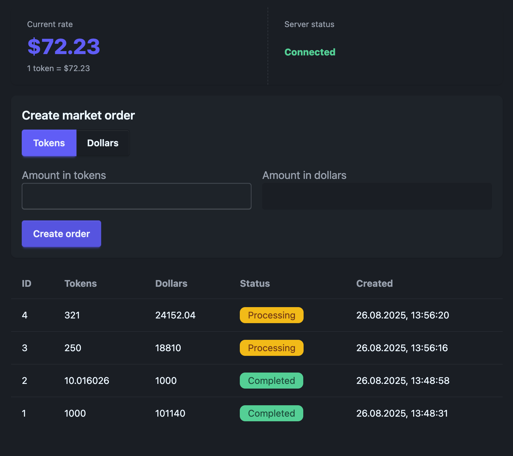

## Тестовое задание

[Описание](./TASK.md)

## Требования

- Node.js >= v20.19.4
- Включить Corepack:

```bash
corepack enable
```

## Структура

- `frontend/` — фронтенд: React + TypeScript + Vite (MobX, Socket.IO client, Tailwind + DaisyUI)
- `backend/` — бэкенд: Express + Socket.IO (TypeScript)

## Команды

- `yarn dev` — запустить бэкенд и фронтенд в дев моде
- `yarn build` — собрать бэкенд (tsc) и фронтенд (vite)
- `yarn start` — запустить бэкенд (node dist) и превью фронтенда
- `yarn dev:backend` — запустить только бэкенд
- `yarn dev:frontend` — запустить только фронтенд


